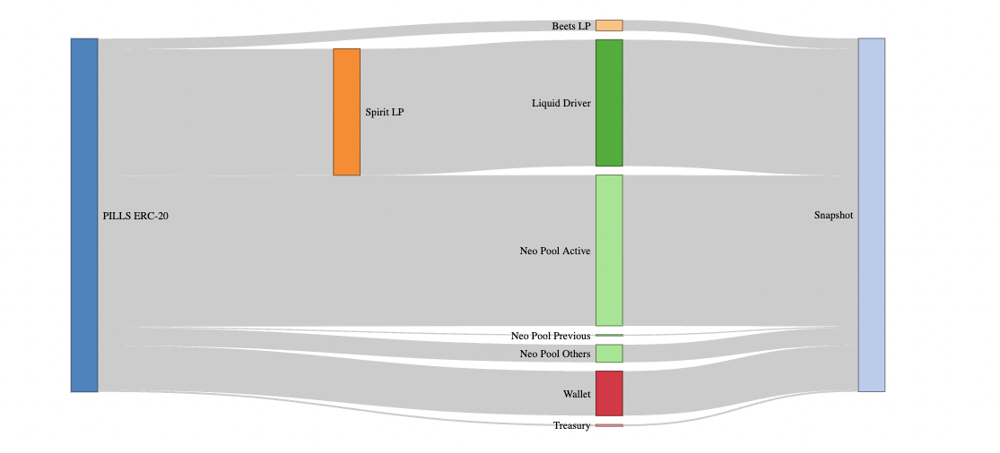

# ms-reports

This repository contains code and analyses that were used to obtain a snapshot of PILLS token holders in April of last year.

## Allocating PILLS Volume to Addresses

The following plot depicts the flow of contracts that controlled PILLS tokens, including the volume they controlled.
The challenge was to trace the total volume of PILLS through these contracts to identify the original PILLS holders, who would be included in the snapshot.

The starting point for this snapshot is the PILLS ERC-20 contract, itself, because it contains a mapping of addresses and their balances.
We obtained a list of possible PILLS holders addresses by searching the Fantom DAG for every address that interacted with the PILLS ERC-20; holders would be a subset of this set.
The PILLS ERC-20 contract was subsequently queried to determine the balances of all PILLS holders.

One challenge to this approach is that some contracts appear to be the holders of many PILLS tokens - but PILLS holders would be those who deposited to the contract, not the contract itself.
We therefore examined Liquid Driver, Beethoven X, Spirit, and Morpheus Swap Neo Pools with the same approach previously described.

Finally, at the end of the plot, we see the snapshot has the same volume as the starting PILLS balance.
In other words, we hope this snapshot captured all the PILLS holders, even if those PILLS were in one of the popular contracts.

## Snapshot

[You can view the snapshot as a CSV file.](data/pills-snapshot.csv)

If you just want to check for the presence of your address, [this file contains just addresses](data/addresses.txt)

Consider using case-insensitive search because all addresses are represented with [EIP-55 mixed case checksums](https://eips.ethereum.org/EIPS/eip-55).
Otherwise, you must search for your EIP-55 checksummed address, which has lower- and uppwer-case letters.

[The airdrop proportions are available here](data/airdrop.csv).

Finally, [address changes are recorded here](data/address-changes.csv). This occurs when the address from the snapshot is not a current address that should receive airdrop tokens. You must manually report any such changes to the team and provide proof of address control.

## Disclaimer

These data are believed to be accurate but **accuracy cannot be guaranteed**.
